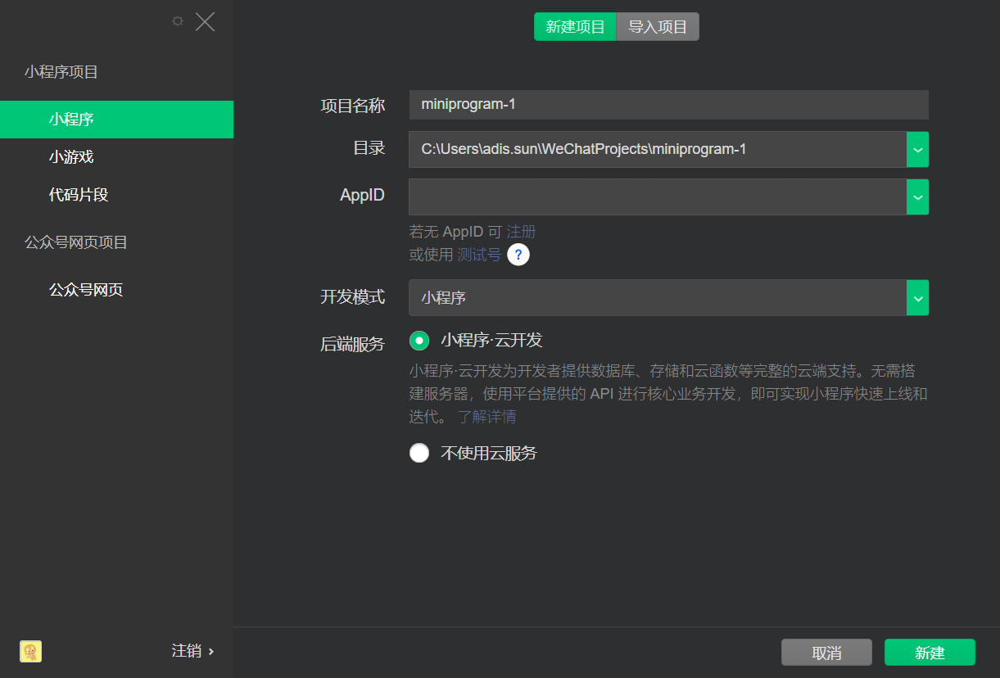

# 微信小程序培训-创建项目

## 准备工作
1. [NodeJS](https://nodejs.org/en/download/ "NodeJS") 下载并安装
2. [微信开发工具](https://developers.weixin.qq.com/miniprogram/dev/devtools/download.html "微信开发工具") 下载并安装

## 创建项目
打开微信开发工具，根据实际项目填写

PS：若无 AppID 可选择测试号



## 创建项目结构
1. 创建  common文件夹存放通用js脚本
2. 创建 icons 文件夹存放icon图片 
3. 分别 login, products, orders页面

创建完毕后项目结构如下：
```
|-- app.js
|-- app.json
|-- app.wxss
|-- project.config.json
|-- sitemap.json
|-- common
|-- icons
|-- pages
    |-- login
    |   |-- login.js
    |   |-- login.json
    |   |-- login.wxml
    |   |-- login.wxss
    |-- orders
    |   |-- orders.js
    |   |-- orders.json
    |   |-- orders.wxml
    |   |-- orders.wxss
    |-- products
        |-- products.js
        |-- products.json
        |-- products.wxml
        |-- products.wxss
```

## 配置 Tabbar
在 app.json 中追加如下代码
```json
"tabBar": {
    "selectedColor": "#1296DB",
    "list": [
      {
        "text": "商品",
        "iconPath": "icons/icon_product.png",
        "selectedIconPath": "icons/icon_product-selected.png",
        "pagePath": "pages/products/products"
      },
      {
        "text": "订单",
        "iconPath": "icons/icon_order.png",
        "selectedIconPath": "icons/icon_order-selected.png",
        "pagePath": "pages/orders/orders"
      }
    ]
}
```

## 集成 Vant Weapp UI 框架
根据 [Vant Weapp](https://vant-contrib.gitee.io/vant-weapp/#/home "Vant Weapp") 官网"快速上手"章节集成 Vant Weapp UI 框架

## 下一步：[登录页面](./2.login-page.md "登录页面")